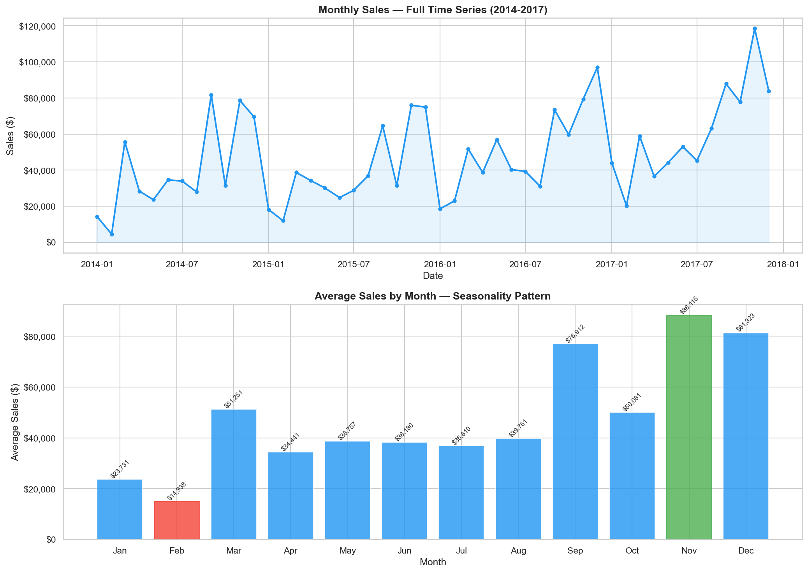
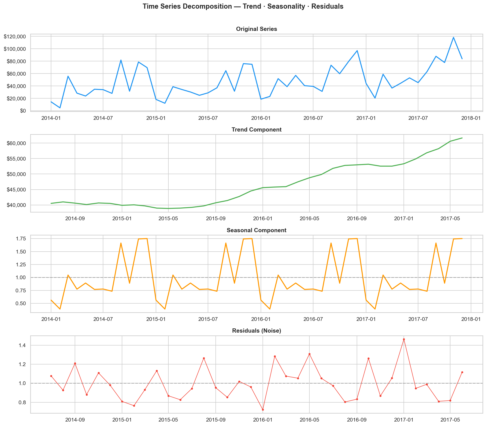
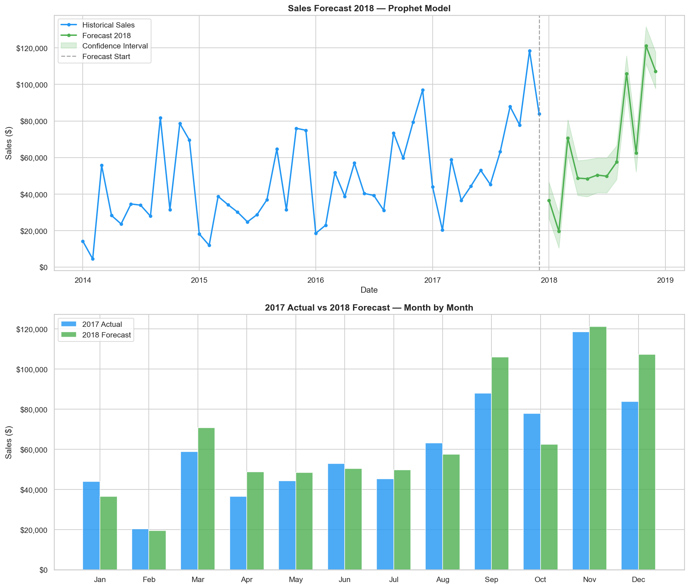
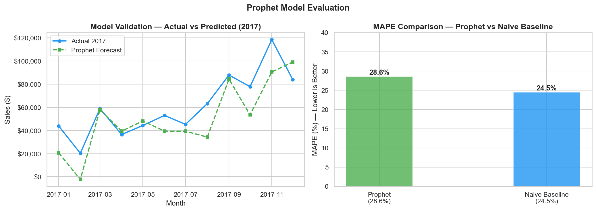
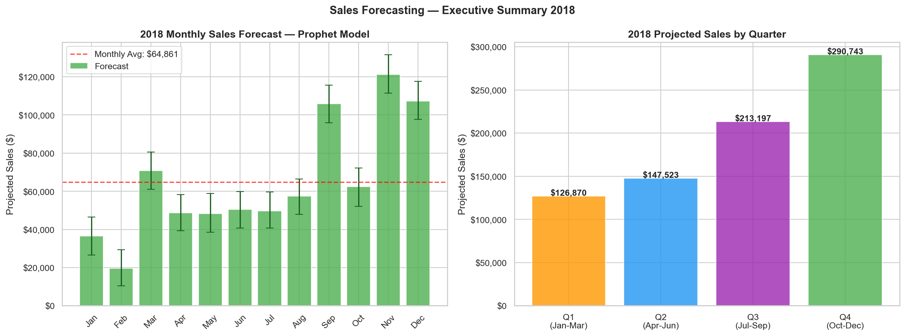

# 📈 Sales Forecasting — Time Series Analysis with Prophet

> **End-to-end sales forecasting project using Facebook Prophet and statistical time series analysis — predicting monthly revenue 12 months ahead for a retail business with 4 years of historical data.**

[](https://python.org)
[](https://facebook.github.io/prophet/)
[]()
[](https://jupyter.org)
[]()

---

## 🧠 The Business Problem

Every retail business faces the same planning challenge: how much will we sell next month? Next quarter?

Without reliable forecasts, companies face two costly failure modes:
- **Underestimate demand** → stockouts, lost sales, frustrated customers
- **Overestimate demand** → excess inventory, capital tied up, increased costs

The stakes are highest in Q4 — when a single bad month can define the entire year.

> *This project builds a forecasting system that predicts monthly sales 12 months ahead, quantifies uncertainty with confidence intervals, and delivers quarterly projections for operational planning.*

---

## ✅ The Solution

An end-to-end time series analysis pipeline that decomposes historical sales into trend, seasonality, and noise components — validates each statistically — and trains Facebook Prophet to generate forward-looking forecasts with business-ready outputs.

> *From 4 years of raw transaction data to a 12-month forecast with quarterly breakdown — in a single reproducible notebook.*

---

## 📐 Architecture Overview

```
┌─────────────────────┐    ┌──────────────────────┐    ┌──────────────────────┐
│  Superstore Dataset │───▶│  Time Series EDA     │───▶│  Statistical Tests   │
│  (4 years · 9,994   │    │  Trend · Seasonality │    │  Mann-Kendall Test   │
│   transactions)     │    │  Decomposition       │    │  H0/H1 · p-value     │
└─────────────────────┘    └──────────────────────┘    └──────────┬───────────┘
                                                                    │
                                              ┌─────────────────────▼──────────┐
                                              │   Prophet Forecasting Model     │
                                              │   12-month forecast · CI        │
                                              │   Quarterly business summary    │
                                              └────────────────────────────────┘
```

---

## 🔄 Methodology — STAR Framework

### Situation
A retail company with 4 years of sales data (2014-2017) across 3 product categories and 4 geographic regions needed to forecast revenue for 2018 to support inventory, staffing, and budget planning decisions.

### Task
Build a forecasting pipeline that:
- Identifies and validates statistical patterns in historical sales
- Decomposes the time series into interpretable components
- Trains and evaluates a forecasting model against a naive baseline
- Delivers a 12-month projection with confidence intervals and quarterly breakdown

### Action

**1 — Exploratory Data Analysis**
- Aggregated 9,994 transactions into 48 monthly data points (2014-2017)
- Identified strong seasonality: November averages $80,115 (best month) vs February at $14,938 (worst month) — a 5x difference
- Confirmed upward trend: average monthly sales grew from ~$40,000 to ~$62,000 over 4 years

**2 — Time Series Decomposition**
Applied multiplicative decomposition to separate three components:
- **Trend:** steady growth from $40,518 to $61,650 (+52.2% over 4 years)
- **Seasonality:** Q4 consistently 75% above average; Q1 consistently 50% below average
- **Residuals:** random noise with no detectable pattern — model captures the signal well

**3 — Hypothesis Testing (Mann-Kendall Test)**
Formally tested whether the observed trend is statistically significant or could be due to random variation:

| | Result |
|--|--|
| H0 | No trend exists in monthly sales |
| H1 | A statistically significant trend exists |
| Kendall's Tau | 0.378 |
| P-value | 0.000153 |
| **Conclusion** | **Reject H0 — trend is statistically significant at p < 0.001** |

The 52.2% growth over 4 years is not random — it reflects genuine business expansion, justifying the investment in forecasting infrastructure.

**4 — Prophet Model Training & Evaluation**

| Metric | Prophet | Naive Baseline |
|--------|---------|---------------|
| MAPE | 28.6% | 24.5% |
| MAE | $14,412 | — |
| RMSE | $17,647 | — |

The naive baseline (repeat last year's values) is competitive — a common outcome with only 4 years of data and high monthly volatility. This is an honest finding: Prophet adds value in trend projection and uncertainty quantification, even when point accuracy is comparable to simpler methods.

**5 — 2018 Forecast & Business Output**

| Quarter | Projected Sales | % of Annual |
|---------|----------------|-------------|
| Q1 (Jan-Mar) | $126,870 | 16.3% |
| Q2 (Apr-Jun) | $147,523 | 19.0% |
| Q3 (Jul-Sep) | $213,197 | 27.4% |
| Q4 (Oct-Dec) | $290,743 | 37.4% |
| **Total 2018** | **$778,332** | **+6.2% vs 2017** |

### Results

**Key Result #1:** The upward sales trend is statistically significant (p < 0.001) — the business is genuinely growing, not just experiencing random fluctuation.

**Key Result #2:** Q4 concentrates 37.4% of annual revenue. Any operational disruption between October and December has disproportionate impact on full-year results.

**Key Result #3:** The model projects $778,332 in total 2018 sales (+6.2% vs 2017), with November as the peak month at $121,137 and February as the trough at $19,564.

**Key Result #4:** Prophet's 28.6% MAPE vs 24.5% naive baseline reveals an important insight — with limited historical data and high volatility, incorporating external variables (promotions, market conditions) would significantly improve forecast accuracy.

---

## 📊 Analysis & Visualizations

**Monthly sales time series and seasonality pattern:**



**Time series decomposition — trend, seasonality, and residuals:**



**2018 forecast vs 2017 actual — month by month comparison:**



**Model evaluation — Prophet vs naive baseline + actual vs predicted:**



**Executive summary — 2018 monthly forecast and quarterly breakdown:**



---

## 🔍 Key Business Insights

| Insight | Recommended Action |
|---------|-------------------|
| Q4 = 37.4% of annual revenue | Plan inventory, staffing and logistics 90 days before October |
| February is consistently the weakest month ($14,938 avg) | Use Q1 for operational improvements, training, and preparation |
| 52.2% sales growth over 4 years (statistically significant) | Forecasting infrastructure is justified — business is genuinely expanding |
| Trend is accelerating in 2017 | Revisit forecast quarterly — growth rate may exceed 6.2% projection |
| High monthly volatility (MAPE 28.6%) | Incorporate promotional calendar and external factors to improve accuracy |

---

## 🛠️ Tech Stack

| Layer | Technology | Purpose |
|-------|------------|---------|
| Data Source | Kaggle — Superstore Sales Dataset | 9,994 retail transactions across 4 years |
| EDA & Preprocessing | Python · Pandas · Matplotlib · Seaborn | Time series aggregation and visualization |
| Statistical Analysis | SciPy · Statsmodels | Decomposition and Mann-Kendall hypothesis test |
| Forecasting | Facebook Prophet | 12-month sales forecast with confidence intervals |
| Evaluation | scikit-learn · MAE · RMSE · MAPE | Model accuracy vs naive baseline |
| Environment | Jupyter Notebook | Full reproducible analysis pipeline |

---

## 📁 Repository Structure

```
sales-forecasting/
│
├── notebooks/
│   └── 01_sales_forecasting.ipynb   # Full pipeline: EDA, decomposition, hypothesis test, forecast
├── data/
│   └── Sample - Superstore.csv      # Source dataset — 4 years of retail transactions
├── img/
│   ├── time_series_overview.png     # Monthly sales + seasonality pattern
│   ├── decomposition.png            # Trend · seasonality · residuals
│   ├── forecast.png                 # 2018 forecast + 2017 vs 2018 comparison
│   ├── model_evaluation.png         # Prophet vs naive baseline + actual vs predicted
│   └── executive_summary.png        # 2018 monthly forecast + quarterly breakdown
├── requirements.txt                 # Python dependencies
└── LICENSE                          # MIT License
```

---

## 📊 Dataset

This project uses the **Sample Superstore** dataset, available on [Kaggle](https://www.kaggle.com/datasets/vivek468/superstore-dataset-final).

The dataset contains retail transaction data including order dates, product categories, regions, sales, quantity, discount, and profit — spanning January 2014 to December 2017.

---

## 👤 Author

**Andrés Navarro**
Data Analyst · Data Science · Python · Time Series · Machine Learning

[](https://github.com/AndyNavarro77)
[](https://www.linkedin.com/in/andr%C3%A9s-navarro77/)
[](https://andres-navarro-portfolio.netlify.app/)

---

*Built to demonstrate end-to-end time series thinking — from statistical validation of trends to actionable quarterly forecasts — using industry-standard tools applicable to any revenue-generating business.*